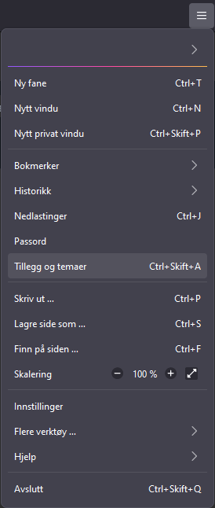
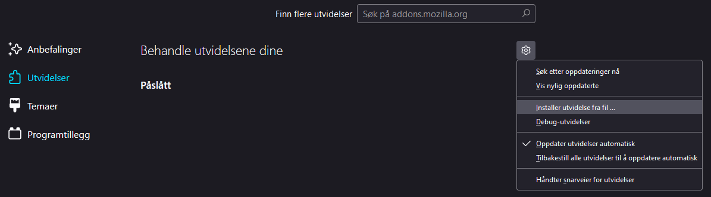

# Adventur Delux - Casino Royal

Browser extension for "card counting" in a Norwegian text RPG called Adventur Delux.
The rest of this README is in Norwegian because of the applicability of the browser extension.

Utvidelsen legger til et ekstra brukergrensesnitt for å vise deg innholdet du kjenner i kortstokken.
På denne måten slipper du å bytte vinduer eller skirve ned for hånd hva innholdet var.
Du får også se hvilket kort som er det neste som kommer.

## Installasjon

Last ned siste utgivelse fra [Releases](https://github.com/Sardtok/adventur-casino/releases).

Når du trykker på lenken til XPI-filen i Firefox,
vil du få et varsel om å installere utvidelsen i nettleseren.

Hvis du velger å laste ned XPI-filen isteden, kan du installere utvidelsen på følgende måte:

1. Åpne *Tillegg og temaer* fra nedtrekksmenyen

2. Trykk på tannhjulet for å åpne menyen for utvidelser, og velg *Installer utvidelse fra fil*

3. Finn XPI-filen på datamaskinen, og velg denne.

Du kan også laste ned kildekoden eller klone git-lageret
og laste utvidelsen som en midlertidig utvidelse fra nettleseren.
For å installere en midlertidig utvidelse i Firefox, gå til siden *about:debugging*,
velg *This Firefox* og *Load Temporary Add-on*. Åpne mappen med utvidelsen
og velg *manifest.json* for å installere utvidelsen frem til du lukker nettleseren.
